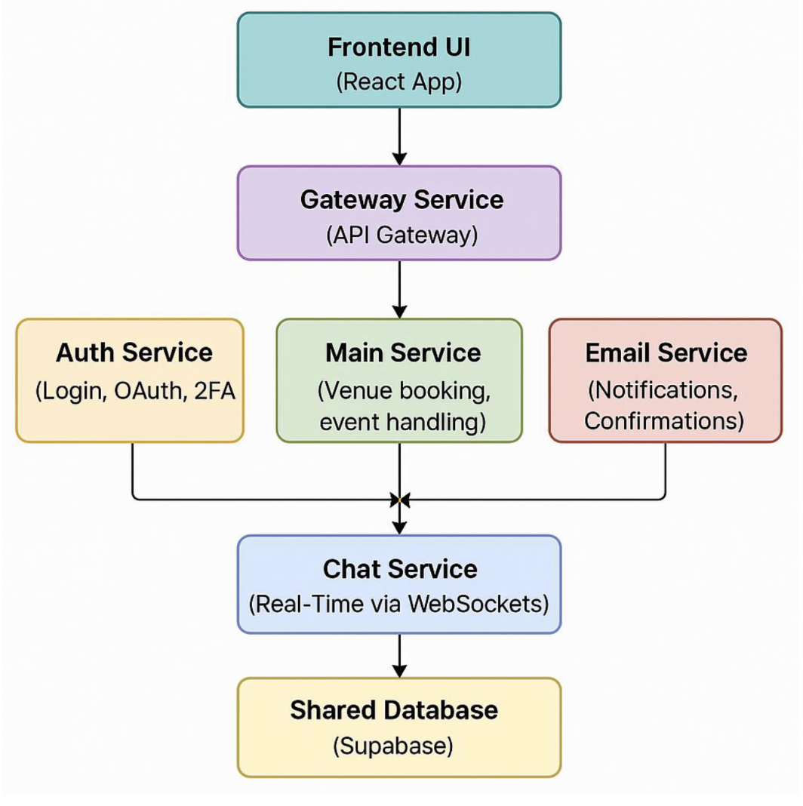

   
# TeamUp

### [Demo Website](https://blue-rock-0d2af4e10.6.azurestaticapps.net/)

TeamUp is a modern sports venue and event management platform built with modern web technologies and a microservices architecture that revolutionizes how sports venues are discovered, booked, and managed, while also providing comprehensive event organization capabilities

## Documentation

- System design: [System_Design.pdf](System_Design.pdf)
- User manual: [Users_Manual.pdf](Users_Manual.pdf)

## Overview

The platform serves three primary user groups:

1. **Venue Owners**
   - Manage multiple venues
   - Track bookings and revenue
   - Handle event scheduling
   - Monitor venue performance
   - Manage customer relationships

2. **Event Organizers**
   - Create and manage sports events
   - Handle participant registrations
   - Manage event schedules
   - Track event performance
   - Coordinate with venue owners

3. **Sports Enthusiasts**
   - Discover nearby venues and events
   - Book venues and register for events
   - Manage bookings and registrations
   - Track favorite venues and events
   - Participate in organized events

##  Features

### Core Services

#### Authentication Service
- Secure JWT-based authentication
- OAuth integration (Google)
- Multi-factor authentication via Duo
- Role-based access control (User/Venue Owner)

#### Venue Management Service
- Create and manage sports venues
- Upload and manage venue images
- Set pricing and availability
- Real-time venue status updates
- Location-based venue discovery

#### Booking Service
- Real-time venue and event booking
- Booking history management
- Cancellation handling
- Booking status tracking
- Email notifications for booking updates

#### Payment Service
- Secure payment processing via Stripe
- Support for multiple payment methods
- Automated receipt generation
- Payment status tracking
- Refund processing

#### Event Management Service
- Create and manage sports events
- Event scheduling and capacity management
- Ticket pricing and sales
- Event status tracking
- Participant management

#### Additional Features
- Interactive map integration using Leaflet.js
- Bookmark system for favorite venues/events
- Real-time analytics dashboard for venue owners
- Email notification system
- Search and filtering capabilities

##  Architecture

### System Design

### Component Details

TeamUp follows a microservices architecture with the following components:

- **Frontend**: React + TypeScript + Material-UI
- **API Gateway**: Node.js + Express.js
- **Backend Services**: Node.js microservices
- **Database**: PostgreSQL (via Supabase)
- **Authentication**: JWT + OAuth2
- **Payment Processing**: Stripe
- **Email Service**: Nodemailer
- **Maps**: Leaflet.js + OpenStreetMap
- **File Storage**: Supabase Storage
- **DevOps**: GitHub Actions (CI/CD) + Docker + Jenkins + JIRA

### System Design Details

#### Booking Interfaces
- **Frontend → Gateway**: `/bookings/user?userId`, `/bookings/details/:bookingId`, `/bookings/cancel/:bookingId` with cancellation reason; handles empty states, auth redirects, retries, and loader timeouts.
- **Gateway → Booking Service**: `/user`, `/details/:id`, `/cancel/:id` mapped to Supabase `venue_bookings` and `event_bookings` with joins to venues, events, and users; cancellation timestamps and metadata stored.
- **Error handling**: graceful empty states, auth failures redirect to login, network/server failures show retry banner, fallback UI for missing venue/event metadata, and toast feedback for failed cancellations.

#### Payment Service (Stripe)
- **Responsibilities**: create checkout sessions after validating user, booking type, and price; verify webhook signatures; confirm bookings only after successful payments; log history and update booking/payment status; no booking created on failure.
- **Flows**: success → booking confirmed, history updated, venue owner (and user) notified via Email Service; failure/timeout → transaction flagged failed and email sent with retry guidance.
- **Interfaces/objects**: `PaymentSessionRequest` (userId, bookingType venue|event, bookingId, amount, currency, optional metadata), `CheckoutSessionResponse` (sessionUrl), Stripe webhook payload with metadata, `BookingConfirmationRecord` (userId, bookingId, bookingType, status confirmed, paymentIntentId, timestamp).
- **Error handling**: 400 for missing fields or invalid booking type, 409 when payment not completed, 500 for Stripe API or DB update failures, 400 for malformed webhook.

#### Venue Owner Event Management
- **Workflow**: multi-step guided flow (details, images, sports/pricing, review) for venue and event creation/editing; image upload with preview and validation; analytics dashboard for bookings, trends, and revenue.
- **Interfaces**: `/venues` POST/PUT/DELETE, `/events` POST/PUT/DELETE, `/analytics/venue/:id` GET (gateway proxies to internal endpoints). Auth middleware enforces owner access.
- **Error handling**: client-side validation for required fields; upload failure retry; 401 redirect to login, 403 access denied for other owners, 500 fallback banner; empty states prompt “Create New”; analytics failures show placeholders.

#### Bookmark and Map Services
- **Bookmark Service**: reusable toggle button and list components; gateway routes `/bookmarks/update` (type, id, action add/remove) and `/bookmarks/fetch`; backend updates Supabase `event_bookmarks` and `venue_bookmarks` with JWT auth; optimistic toasts, duplicate protection, fallback “No bookmarks yet.”
- **Map Service**: `MapComponent.tsx` with `geocodingUtils.ts` using OpenStreetMap Nominatim; supports configurable center/zoom/markers; used in venue/event detail pages; rate limiting, caching, and fallbacks for bad coordinates (“Map Unavailable”).

## Key Features

- **User Authentication**
  - Users (sports enthusiasts and venue owners) can sign up and log in using email/password or OAuth (Google)
  - Optional Duo-based multi-factor authentication for enhanced security

- **Venue and Event Listings**
  - Venue owners can create and manage venues and events using a multi-step form
  - Image uploads, pricing, and capacity configurations
  - Comprehensive venue and event management dashboard

- **Booking System**
  - Search for venues or events by sport type, location, or venue name
  - Book available time slots with real-time availability checking
  - Instant booking confirmation

- **Booking Management**
  - View, cancel, and manage bookings with detailed information
  - Track booking time, venue, and payment status
  - Email notifications for booking updates

- **Payment Integration (Stripe)**
  - Secure payment processing using Stripe during the booking flow
  - Only confirmed payments result in finalized bookings
  - Automated receipt generation

- **Interactive Map View**
  - Map integration using Leaflet and OpenStreetMap
  - View venue/event locations and interact spatially with listings
  - Location-based venue discovery

- **Bookmark Feature**
  - Bookmark favorite venues/events for quick access
  - Managed per user with reusable UI toggle
  - Personalized user experience

- **Real-time Analytics**
  - Venue owners can view booking and revenue analytics
  - Track performance and user engagement over time
  - Data-driven decision making

- **Email Notifications**
  - Integrated with Nodemailer (via Google SMTP)
  - Send booking confirmations, payment statuses, and alerts
  - Automated communication system

- **Robust Error Handling**
  - Full-stack error feedback
  - User-friendly frontend messages
  - Retry prompts and sanitized backend responses

## What I Learned

- **Authentication Systems**
  - Implemented advanced login flows with JWT, OAuth, and Duo MFA
  - Reinforced secure and scalable access control
  - Role-based permission management

- **Microservices Architecture**
  - Gained experience designing a modular system
  - Dedicated services for authentication, booking, payment, and external APIs
  - Service communication patterns

- **React & TypeScript**
  - Built reusable UI components with React and TypeScript
  - Improved maintainability and type safety across the frontend
  - Advanced state management

- **Backend Development with Node.js & Express**
  - Designed scalable REST APIs
  - Integrated third-party services (Stripe, Supabase, Nodemailer)
  - API security and optimization

- **Database Design with PostgreSQL & Supabase**
  - Developed normalized schemas for users, bookings, venues, and events
  - Secure Supabase integration
  - Query optimization and indexing

- **Stripe Payments**
  - Implemented secure and PCI-compliant payment flows
  - Used Stripe's checkout and webhook APIs
  - Payment error handling and recovery

- **Interactive UI/UX Design**
  - Collaborated using Figma for mockups
  - Used Material UI and React Leaflet for clean, responsive interfaces
  - User-centered design principles

- **CI/CD & GitHub Actions**
  - Automated deployment pipelines and testing flows
  - Streamlined development process
  - Consistent release management

- **Real-time Communication**
  - Integrated WebSocket-based communication
  - Implemented live updates
  - Enhanced user interactivity

- **Geolocation & Mapping**
  - Integrated geocoding and mapping services
  - Improved venue discovery based on user location
  - Location-based features

- **Project Management & Agile Practices**
  - Used JIRA to plan and track sprint-based development
  - Led to iterative improvements
  - Rapid delivery methodology

